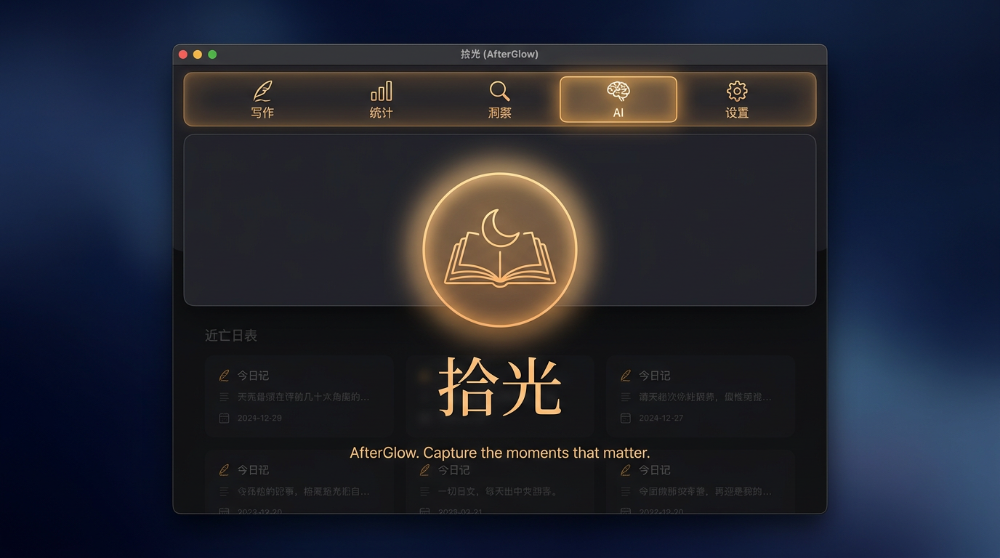
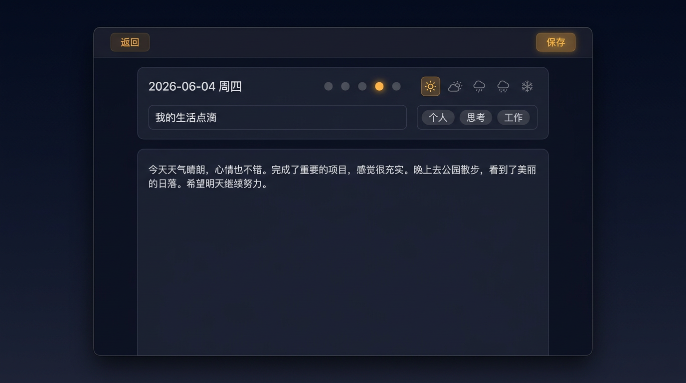
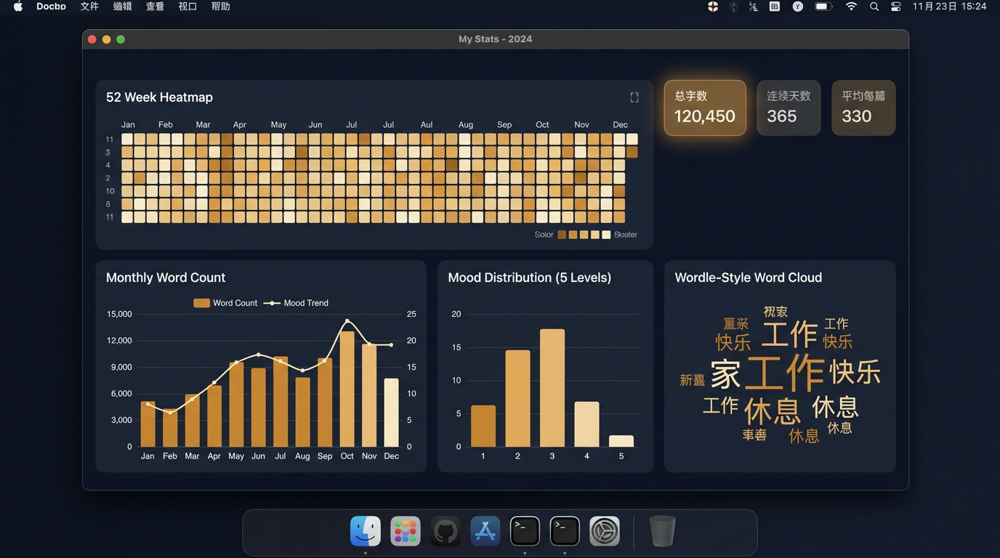
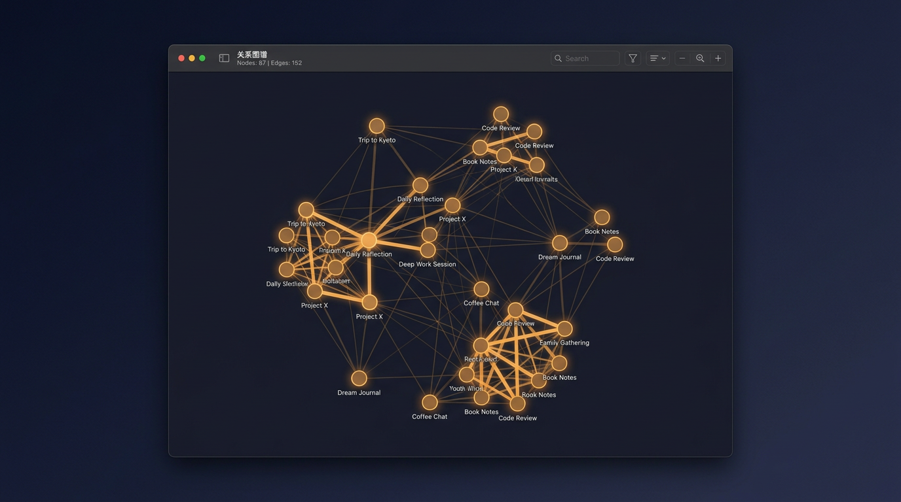
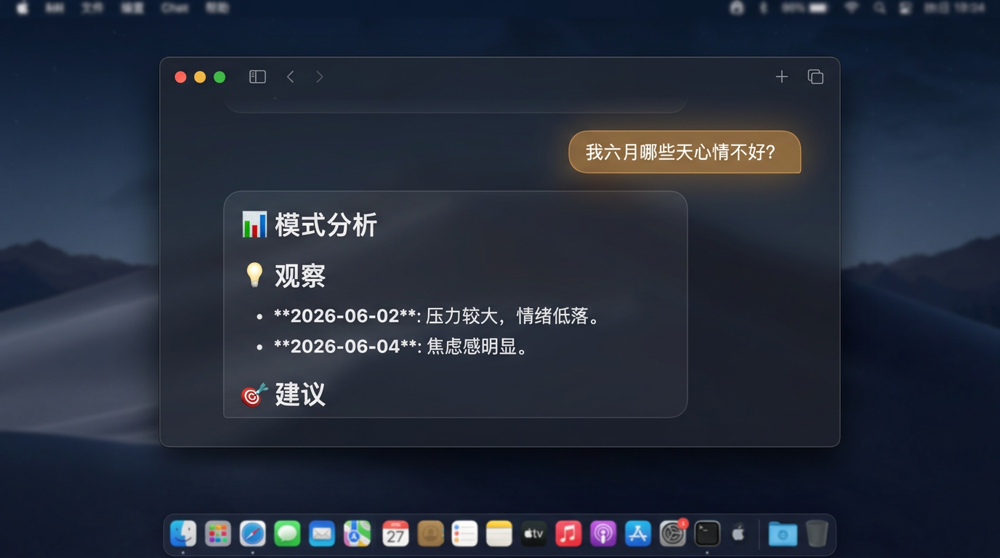
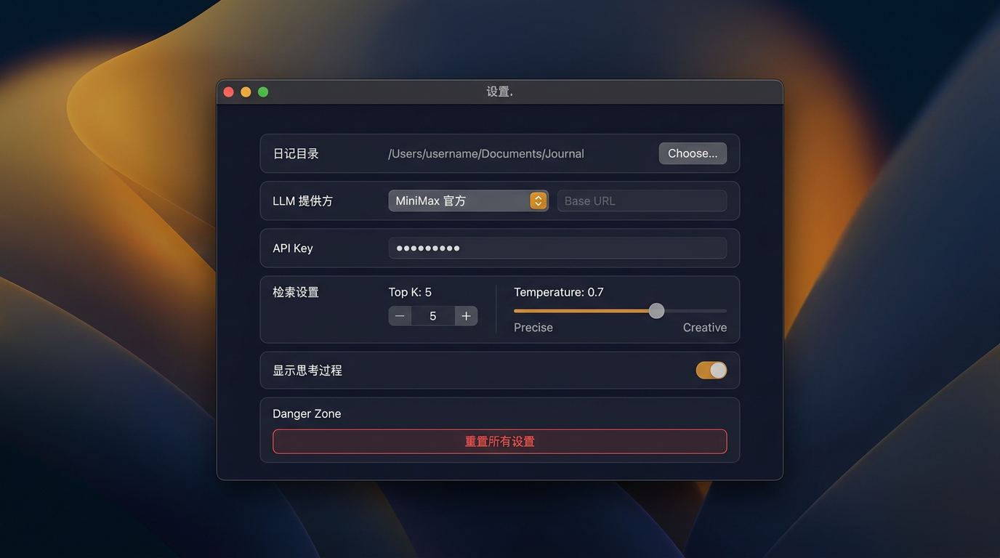

# 拾光 · AfterGlow

> **把过去写下的字，重新照亮一遍。**
>
> 一只读你本地 Markdown 日记的 macOS 桌面 app。
> 零输入框 —— 选一个目录，统计、情绪、关系图谱自动展开；想问什么，直接问。

<p align="center">
  
</p>

<p align="center">
  <a href="https://github.com/Rain-Shuoyu/AfterGlow-AI-Powered-Reflective-Journal-Manager/releases/tag/v0.3.0">
    
  </a>
  &nbsp;
  <a href="https://github.com/Rain-Shuoyu/AfterGlow-AI-Powered-Reflective-Journal-Manager/releases">
    
  </a>
</p>

> **v0.3.0 新增 🕯 周年回响 + 🪞 镜像回放** — 让时间自己说话。**0 LLM token**。

---

## 5 个 tab，一整天都在和过去的自己对话

| 写作 | 统计 | 洞察 | AI | 设置 |
| --- | --- | --- | --- | --- |
| Live-markdown 编辑器 | 52 周热力图 | 余弦相似度关系图 | 自由问答 | API Key / 模型 / 自定义 prompt |
| 心情 · 天气 · 标签 | 词云 / 情绪分布 | 力导向布局 | 流式结构化输出 | 检索 / 温度 / 重置 |
| 回收站（软删除 + 恢复） | 月度字数趋势 | 悬停高亮邻居 | `↩` 发送 / `⇧↩` 换行 | |

> **macOS 26+ · Apple Silicon · Swift 5.9 / 6.2 · 纯 SwiftUI · 单进程，无第三方 SDK。**

---

## ✨ v0.2 新功能：自我探索 / 写作疗愈

v0.2 的核心转向：从"日记 + AI 问答"升级到"**把写作本身变成疗愈**"。

### 🌙 今日签（每日仪式）

打开 app，**洞察 tab** 头部多了一个 **🌙 今日签** 按钮。点开是一个暗色 sheet，里面是今天的内省题目——从 24 个题库里按日期 hash 选，**同一天看到的题目是稳定的，跨日才换题**。

题库覆盖 8 个类别：感激 / 承认 / 自我对话 / 观察 / 行动 / 问题 / 欣赏 / 释放。1-2 分钟写完，点 "我写完了 ✓" 自动保存为今天日记的 `## 🌙 今日签` 段。如果今天还没日记，自动建一个 `YYYY-MM-DD.md`。

**关键设计**：题目池是**纯静态本地数据，0 token 成本**。连续 7 天显示 🔥，跳过不扣分（gentle streak）。

### ✍️ 现在写一封（自我对话信）

**写作 tab** 顶部多了一张 **🪞 写一封信** 卡片。点开有 5 种收信人：

| 收信人 | 适合 |
| --- | --- |
| 🪞 3 个月前的自己 | 焦虑 / 抑郁 / 不知道该怎么办 |
| 🕊 已经释怀的某天 | 回顾一段已经走出来的低谷 |
| 🌱 1 年后的自己 | 迷茫 / 想立 flag |
| 💌 想原谅的人 | 还在生气 / 内耗 |
| 🌅 5 年后的自己 | 拖延 / 不知道开始 |

**核心原则：LLM 只起头，主体必须用户自己写。** 写作疗愈的价值在"把话写下来"这个动作，不在"看 AI 描述你的感受"。

所以流程是：选收信人 → AI 写 ~80 字开场白 + 收尾（10 秒）→ 完整编辑器打开，用户接着写 → 保存自动归档到今天日记，frontmatter `tags: [letter, scenario_id]`。

可以随时点 "不，AI 帮不了，我自己来" 跳过 LLM 起头。

---

## ✨ v0.3 新功能：让时间自己说话

v0.3 同样**不调 LLM**——两个新功能都是纯本地计算，复用现有 embedding 索引，0 token 成本。

### 🕯 周年回响（时间纵深）

每年的今天 / 明天 / 后天（6/15 ±1），启动 app 时**顶部 banner 自动出现**：「往年的今天，你写过 — 回看」。

匹配你历史上同月同日的日记，**1 年前 / 2 年前 / 3 年前...**（max 5 年）。每篇只显示前 3 段，加 "打开完整日记" 跳转。banner ✕ 关掉今日；设置里可永久关闭。3 天去重，不会连续 3 天都弹。

缺失的年份不强行编——如果你 1 年前没写、2 年前写了，banner 只展示有的那 1 篇。**留空比假装更尊重真实**。

洞察 tab 头部的 "🕯 周年" 按钮可以**手动随时打开**，不受 ±1 天窗口限制。

### 🪞 镜像回放（自我同一性的"啊哈"时刻）

洞察 tab 头部新按钮 "🪞 镜像"。点开是 5-7 句**你自己写过的句子**，按时间顺序排列。

- **多样性采样**（不是相似度采样！）：用 Apple 的 `NLEmbedding.simplifiedChinese` + 简单 MMR 算法（λ=0 = 纯多样性），保证 6 句不重复讲同一件事
- **两种模式**：
  - 🎲 **随机**（默认）— 从过去 180 天随机抽 8-12 篇，挑出最不像的 6 句
  - 🏷 **主题**（可选）— 工作 / 感情 / 自我，embedding 检索最相关的 6 句
- **0 LLM**：全部本地
- **可复制** / **可换一组**：一键复制整段到剪贴板，或者立即重新采样

读到 3 年前自己写的字，那种"原来我已经走了这么远"的感觉，是这个功能的核心价值。

---

## ✍️ 写作

打开一篇日记就是一个**全屏编辑器**。左边是元数据（日期 / 心情 / 天气 / 标签），右边是正文。

<p align="center">
  
</p>

- **Live markdown** — `⌘B` 粗体，`⌘I` 斜体，`⌘K` 行内代码，`⌘1-6` 标题，`⌘0` 段落。Markdown 标记被渲染层藏起来，光标直接走字符之间 —— 像 Typora，但更安静。
- **5 档心情** — 自定义 30×30 dot + 44×44 命中区，按一下加 amber 发光。也可以「**AI 决定**」让模型从正文推断。
- **10 个天气预设** + 自定义文本框。选预设时文本框显示中文「雨」而不是符号 `cloud.rain.fill`，写入时还是符号（前端列表照样渲染）。
- **回收站** — `⌘⌫` 删除到 `~/Library/Application Support/ShiGuang/Trash/`，一键恢复时自动重命名去冲突。统计 / 关系图 / AI 索引**自动同步**。

---

## 📊 统计

挑一个目录，自动出 5 块内容。

<p align="center">
  
</p>

- **52 周热力图** — GitHub 风格，琥珀色按 mtime 强度染色
- **月度字数柱 + 平均情绪折线** — 一眼看出写得多 / 心情好的月份
- **情绪分布** — 1~5 直方图
- **词云** — Wordle 风格，CJK 用 `NLTokenizer` 正确分词
- **小药丸** — 总字数、连续天数、平均每篇字数

> 全部本地计算，**零网络请求**。

---

## 🔗 洞察（关系图谱）

每篇日记 = 一个节点。**线越粗 = 越相关**。

<p align="center">
  
</p>

- 用 Apple `NLEmbedding.wordEmbedding(.simplifiedChinese)` **本地**给每篇日记算向量
- 两两余弦相似度，**阈值 0.50** 才连线 —— 只留真有关联的
- 边宽按 `sqrt(similarity)` 拉伸，相似度越高线**明显更粗**
- **不需要 API Key** —— 纯本地，永久免费
- 悬停高亮邻居，点击节点查看完整 entry

> 缓存到 `~/Library/Application Support/ShiGuang/embeddings.json`，按内容 hash 失效 —— 100 篇日记 1 秒以内构建完成。

---

## 💬 AI 助手

问「我六月份哪些天心情不好？」「最近一个月我都关心些什么？」「我和家人之间发生过哪些冲突？」—— 模型回你一份**带标题、列表、加粗、emoji 的结构化报告**。

<p align="center">
  
</p>

- 默认接 **MiniMax 官方公开 API**（OpenAI 协议，端点 `https://api.minimax.chat/v1/chat/completions`，模型 `MiniMax-M2.7`）
- 也支持 **OpenAI / Anthropic Messages / 任何 OpenAI 兼容服务**（Azure、vLLM、Ollama…）
- **本地语义检索** —— 用上面的 `EmbeddingIndex` 算余弦相似度挑出最相关的 N 篇日记再喂给模型
- **流式输出** —— 字一个字蹦出来；结构化 Markdown 边输出边渲染
- 智能段后处理 —— 即使模型不写空行也帮你拆
- `↩` 发送，`⇧↩` 换行

---

## ⚙️ 设置

<p align="center">
  
</p>

切换协议下拉框，**base URL 和模型名自动换成对应默认值**。基本只需要填一个 API Key 就能用。

- **日记目录** — 选一次记住，下次启动自动恢复
- **LLM 提供方** — MiniMax / OpenAI / Anthropic，自定义 BaseURL
- **检索** — 每次送 LLM 的篇数（5–200），Temperature
- **自定义系统提示词** — 拼到默认 prompt 后面
- **危险操作** — 一键恢复所有设置

---

## 🔒 隐私

- **只读**你的 `.md` 文件，从不写回（除非你点保存）
- API Key 存**本机**，不进 plist
- 没有任何埋点 / 分析
- 网络请求**只发**到你在设置里填的 base URL

---

## 🏃 跑起来

**下载现成 .app**：[Releases 页面](https://github.com/Rain-Shuoyu/AfterGlow-AI-Powered-Reflective-Journal-Manager/releases) → 挂载 `ShiGuang-0.2.0.dmg` → 把 `ShiGuang.app` 拖到 `/Applications`。

> **Gatekeeper 提示**：这是个人项目，没有 Apple Developer ID 签名，macOS 会弹"无法检查恶意软件"。两种解法：
> 1. **右键打开**：`ShiGuang.app` 上右键 → 打开 → 在弹框里再点一次 "打开"，之后双击就正常。
> 2. **解除 quarantine**：`xattr -dr com.apple.quarantine /Applications/ShiGuang.app`

**或者从源码编译**：

```bash
git clone https://github.com/Rain-Shuoyu/AfterGlow-AI-Powered-Reflective-Journal-Manager
cd AfterGlow-AI-Powered-Reflective-Journal-Manager
./build-app.sh
open build/ShiGuang.app
```

第一次会编译 ~30 秒。然后：

1. 切到「**统计**」tab → 点「**选择目录**」→ 挑你的日记目录
2. 切到「**设置**」tab → 填你的 API Key（默认已经填好 MiniMax 端点）
3. 切到「**AI**」tab → 问问题
4. 切到「**洞察**」tab → 看关系图

> 想从源码开发：`xed Package.swift`，Xcode 会把 SwiftPM 当项目打开，能断点 + Preview。

---

## 📝 日记格式

文件名 `YYYY-MM-DD.md`，**可选** YAML frontmatter（推荐用）：

```markdown
---
date: 2026-06-05
mood: 2
mood_label: 焦虑
weather: cloud.rain.fill
tags: [工作, 焦虑]
title: 周二崩了
---

正文从这里开始。
```

LLM 看到的是 markdown 简化版（标题符去掉、链接保留文字、图片去掉 URL、引用去掉 `>`、列表去掉 marker），省 token。

---

## 🛠 技术栈

- Swift 5.9 / 6.2
- macOS 26+
- SwiftUI + Charts + NaturalLanguage
- SPM 构建（无 Xcode project）
- `build/ShiGuang.app` 自包含 bundle

---

## 📦 版本

- [v0.3.0](https://github.com/Rain-Shuoyu/AfterGlow-AI-Powered-Reflective-Journal-Manager/releases/tag/v0.3.0) — 2026-06-15 · 🕯 周年回响 + 🪞 镜像回放
- [v0.2.0](https://github.com/Rain-Shuoyu/AfterGlow-AI-Powered-Reflective-Journal-Manager/releases/tag/v0.2.0) — 2026-06-15 · 🌙 今日签 + ✍️ 现在写一封
- [v0.1](https://github.com/Rain-Shuoyu/AfterGlow-AI-Powered-Reflective-Journal-Manager/releases/tag/v0.1) — 2026-06-08

### Roadmap

- ~~🌙 今日签（每日仪式）~~ — ✅ v0.2.0
- ~~✍️ 现在写一封（自我对话信）~~ — ✅ v0.2.0
- ~~🕯 周年回响（1-year-ago today entry）~~ — ✅ v0.3.0
- ~~🪞 镜像回放（echo own words, no commentary）~~ — ✅ v0.3.0
- 🌧 情绪急救（one-line mood log on low-mood days）
- 📓 自我追问（LLM asks, user may answer）
- 监听文件变化（自动刷新）
- 导出周报 / 月报成 PDF
- 多日记本（多目录切换）
- Notarized + Mac App Store 分发

---

## License

MIT。
